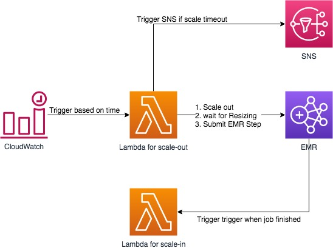

# 定制 EMR Schedule

原理图



自动创建依赖 [Serverless Framework](https://serverless.com)

## 如何执行

* 创建一个 `config.ENV.json` ENV 为 stage

* 修改 `config.ENV.json` 中的参数

* 在 **serverless.yml** 中找到 `cron(0 19 * * ? *)`, 修改 Lambda 触发时间 

* 执行 **serverless framework** 部署
```shell
sls deploy --aws-profile default --stage <ENV>
```

* 在自动创建的 **SNS Topic** 中添加 **邮件 Subscription** 

* 修改 `emr.js` 中的 **TODO** 部分来提交 **EMR Step**

* 在执行 Step 执行完毕的脚本中调用 `scale-in` lambda 来缩小 EMR Group

